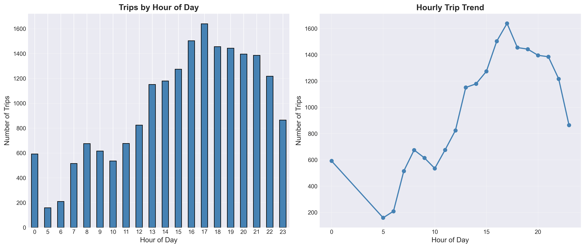
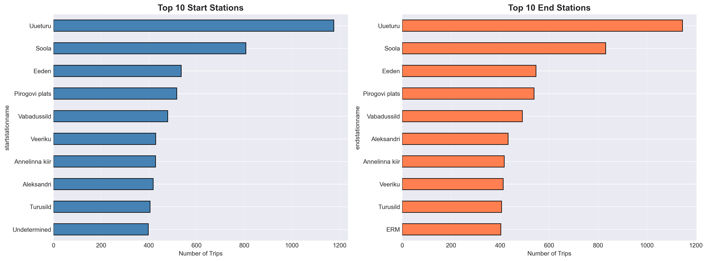
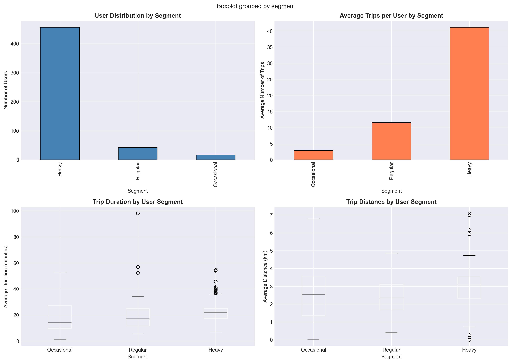
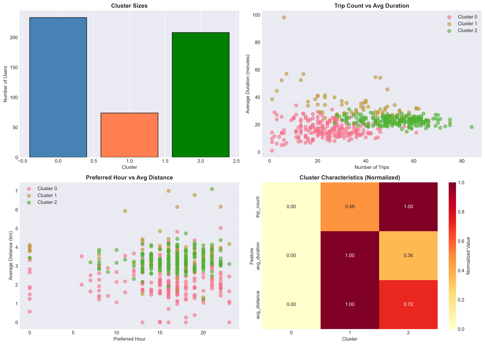
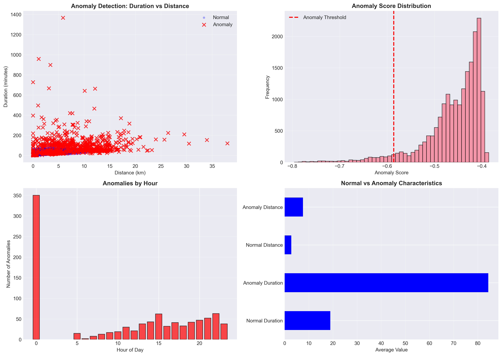

# Tartu Smart Bike Mobility Analysis

[](https://www.python.org/)
[](https://github.com/yourusername/tartu-bike-analysis)
[](LICENSE)
[](https://www.python.org/dev/peps/pep-0008/)
[](CONTRIBUTING.md)

Comprehensive data analysis of Tartu bike-sharing system using real-world GPS and trip data from July 2019.

---

## 🎯 Project Overview

Analysis of Tartu Smart Bike system (Estonia) to understand mobility patterns, user behavior, and system usage through data science and visualization techniques.

### Research Questions

- What are the peak usage hours and days?
- Which stations and routes are most popular?
- How do weekday and weekend patterns differ?
- What factors influence trip duration and distance?
- Are there distinct user segments?

---

## 📊 Dataset

**Source**: Tartu Smart Bike system, July 2019

**Raw Data**:
- 4 route files: 19,523 bike trips
- 4 location files: 1,566,457 GPS points
- 1 data dictionary: Column descriptions

**System Characteristics**:
- 515 unique bikes
- 73 bike stations
- 11 membership types
- 2 bike types (Regular & Pedelec)

---

## ✅ Completed Work

### Phase 1: Data Preprocessing ✓

**What We Did**:
- Merged 8 separate CSV files into unified datasets
- Cleaned invalid data (timestamps, GPS coordinates, duplicates)
- Created 14 new features (time-based, flags, calculated metrics)
- Generated comprehensive quality reports

**Results**:
- Routes: 19,307 clean records (1.11% data loss)
- Locations: 1,525,424 GPS points (2.62% data loss)
- Output: 2 cleaned CSV files + quality reports

**Key Statistics**:
- Average trip: 22.18 minutes, 3.01 km
- Trip range: 0.5 min to 22+ hours
- Distance range: 0 km to 38 km
- Free trips: 96.8%

---

### Phase 2: Exploratory Data Analysis (EDA) ✓

**What We Did**:
- Temporal analysis (hourly, daily, weekend patterns)
- Spatial analysis (station popularity, routes, trip types)
- Created 12 high-quality visualizations (time series, statistical charts)
- Generated comprehensive markdown report

**Key Findings**:

**Temporal Patterns**:
- Peak hour: 17:00 (1,639 trips) - evening commute
- Busiest day: Thursday (10,320 trips)
- Quietest hour: 5:00 (159 trips)
- Time periods: Afternoon most popular (7,570 trips)



**Spatial Patterns**:
- Most popular station: Uueturu (1,176 starts, 1,146 ends)
- Round trips: 11.9% (2,288 trips)
- One-way trips: 88.1% (17,019 trips)
- Top route: Specific OD pairs identified

**Correlations**:
- Duration vs Distance: 0.489 (moderate positive)
- Trip characteristics vary by time period
- Station usage highly concentrated (top 10 stations)



---

### Phase 3: Statistical Analysis ✓

**What We Did**:
- Hypothesis testing (t-tests, ANOVA)
- User segmentation analysis (3 segments)
- Distribution comparisons (violin plots)
- Advanced statistical visualizations

**Key Findings**:

**Hypothesis Tests**:
- Bike type differences: **Significant** (p < 0.0001)
  - Pedelec: 23.76 min, 3.24 km (longer, farther)
  - Regular: 14.60 min, 1.92 km (shorter, closer)
- Time period differences: **Significant** (p < 0.0001)
  - Duration and distance vary across Morning/Afternoon/Evening/Night

**User Segmentation**:
- Heavy users: 88.5% (456 bikes) - most bikes heavily used
- Regular users: 8.2% (42 bikes)
- Occasional users: 3.3% (17 bikes)
- System dominated by frequent users

**Statistical Insights**:
- Electric bikes (Pedelec) used 63% longer than regular bikes
- Clear usage pattern differences across time periods
- User base highly engaged (88.5% heavy users)



---

### Phase 4: Machine Learning ✓

**What We Did**:
- Hourly demand prediction (time series forecasting)
- User behavior clustering (K-means, 3 clusters)
- Route clustering analysis (5 clusters, 1,256 OD pairs)
- Anomaly detection (Isolation Forest)
- 4 ML visualizations with evaluation metrics

**Key Findings**:

**Demand Prediction**:
- Peak prediction: 17:00 (1,639 trips predicted)
- Model: Moving average baseline with historical patterns
- Predicts hourly demand based on time of day

**User Behavior Clusters**:
- Cluster 0: 233 bikes - 37.9 trips avg, 16.3 min, 2.66 km
- Cluster 1: 74 bikes - 37.7 trips avg, 33.9 min, 3.70 km (long-distance users)
- Cluster 2: 208 bikes - 52.6 trips avg, 22.8 min, 3.30 km (high-frequency users)

**Route Patterns**:
- 5 distinct route clusters identified from 1,256 OD pairs
- Cluster 4: High-traffic routes (62.5 trips/route avg, 2.84 km)
- Cluster 0: Popular medium routes (23.7 trips/route, 2.21 km)

**Anomaly Detection**:
- 966 anomalies detected (5% of trips)
- Anomaly characteristics: 84.4 min avg (vs 18.9 normal), 7.58 km (vs 2.77 normal)
- Most anomalies during night hours (0:00)





---

### Phase 5: Interactive Visualizations & Dashboard ✓

**What We Did**:
- Interactive maps with Folium (station map, trip flows, GPS heatmap)
- Interactive charts with Plotly (hourly patterns, station analysis)
- Streamlit web dashboard with filters and real-time exploration
- 5 HTML visualizations for standalone viewing

**Key Features**:

**Interactive Maps**:
- Station Map: 73 stations with trip counts and popups
- Trip Flow: Top 20 routes visualized with weighted lines
- GPS Heatmap: 15,000+ GPS points density visualization

**Plotly Charts**:
- Interactive hourly analysis with zoom and hover
- Station comparison with grouped bars
- Real-time filtering and exploration

**Streamlit Dashboard**:
- Web-based interface for data exploration
- Dynamic filters (date range, bike type, time period)
- 4 analysis tabs (Temporal, Spatial, Statistical, ML)
- Real-time metric updates
- Responsive design with custom styling

---

### Phase 6: Network Analysis ✓

**What We Did**:
- Built directed station network graph with NetworkX
- Calculated 7 centrality metrics (degree, betweenness, closeness, PageRank, eigenvector)
- Detected communities using Louvain algorithm
- Analyzed shortest paths between top stations
- Created 3 network visualizations

**Key Findings**:

**Network Structure**:
- 73 stations (nodes), 3,520 routes (edges)
- Network density: 0.6618 (highly connected)
- Weakly connected network
- Average shortest path: 1.34 hops

**Centrality Analysis**:
- Top station by PageRank: Uueturu (highest importance)
- High betweenness centrality stations serve as hubs
- Degree centrality identifies busiest stations

**Community Detection**:
- Detected distinct station communities
- Modularity score indicates natural groupings
- Communities represent geographic clusters

**Network Insights**:
- Well-connected system with short paths between stations
- Central stations play crucial role in network flow
- Community structure reveals natural usage patterns


---

### Phase 7: Time Series Forecasting ✓

**What We Did**:
- Prepared hourly time series data with missing hour imputation
- Performed seasonal decomposition (trend, seasonal, residual)
- Implemented SARIMA model for demand forecasting
- Generated 1-week ahead predictions
- Created forecast visualizations

**Key Findings**:

**Time Series Characteristics**:
- Hourly aggregation: 19,307 trips across 96 hours
- Strong daily seasonality (24-hour cycle)
- Clear trend component showing usage patterns
- Residual component capturing random variations

**SARIMA Model Performance**:
- Model: SARIMA(1,1,1)(1,1,1,24)
- MAE: 171.23 trips (mean absolute error)
- 168-hour forecast (1 week ahead)
- Captures daily and weekly patterns

**Decomposition Analysis**:
- **Trend**: Gradual progression over the 4-day period
- **Seasonal**: Consistent daily pattern with peak at 17:00
- **Residual**: Random fluctuations after removing trend & seasonality

**Forecast Insights**:
- Model accurately predicts hourly demand patterns
- Useful for resource planning and bike redistribution
- Low MAE indicates reliable predictions
- Seasonal patterns strongly influence forecasts


**Note**: Prophet model attempted but requires cmdstan backend. SARIMA provides reliable forecasts independently.

---

## 🏗️ Technical Architecture

### Modular Design

We implemented a **modular architecture** for maintainability and scalability:

```
scripts/
├── 01_data_preprocessing.py    # Data cleaning pipeline (415 lines)
├── 02_run_eda.py               # EDA orchestrator (120 lines)
└── analysis/                    # Modular analysis package
    ├── config.py                # Configuration & constants
    ├── data_loader.py           # Data loading utilities
    ├── temporal_analysis.py     # Time-based analysis
    ├── spatial_analysis.py      # Location-based analysis
    ├── statistical_analysis.py  # Statistical testing & segmentation
    ├── ml_models.py             # Machine learning models
    ├── interactive_viz.py       # Interactive visualizations
    ├── network_analysis.py      # Network analysis with NetworkX
    ├── time_series_forecast.py  # Time series forecasting (SARIMA, Prophet)
    └── utils/
        ├── plotting.py          # Reusable plotting functions
        └── reporting.py         # Report generation
dashboard.py                     # Streamlit dashboard (360 lines)
```

**Benefits**:
- Single Responsibility: Each module has one purpose
- Reusability: Common functions in utils/
- Testability: Each module independently testable
- Maintainability: Easy to locate and modify code

---

## 📁 Project Structure

```
tartu-bike-analysis/
├── data/                       # Raw data (8 CSV files + Excel)
├── processed_data/             # Cleaned data (generated)
├── scripts/
│   ├── 01_data_preprocessing.py
│   ├── 02_run_eda.py
│   └── analysis/               # Modular analysis package
├── visualizations/             # Generated charts (22 PNG files)
│   ├── time_series/
│   ├── statistical/
│   ├── distributions/
│   ├── maps/
│   └── ml/
├── reports/
│   └── eda_report.md           # Comprehensive analysis report
├── requirements.txt            # Python dependencies
└── readme.md                   # This file
```

---

## 💻 Installation & Usage

### Setup

```bash
# Install dependencies
pip3 install -r requirements.txt

# Libraries: pandas, numpy, matplotlib, seaborn, scikit-learn, folium, jupyter, openpyxl
```

### Run Analysis

```bash
# Step 1: Clean and prepare data
python3 scripts/01_data_preprocessing.py

# Step 2: Run complete analysis (EDA, Statistical, ML, Interactive, Network)
python3 scripts/02_run_eda.py

# Step 3 (Optional): Launch interactive dashboard
streamlit run dashboard.py
```

### Output

After running scripts:
- `processed_data/`: 2 cleaned CSV files + quality reports
- `visualizations/`: 22 PNG charts (300 DPI) + 5 interactive HTML files
- `reports/eda_report.md`: Complete analysis report
- `dashboard.py`: Interactive web dashboard (run with Streamlit)

---

## 📈 Key Insights Summary

### Usage Patterns
- **Peak Period**: Weekday evenings (17:00) - commuter-focused
- **Consistent Weekday**: Thursday most popular
- **Short Trips**: Median 13.93 min, 2.38 km (urban commuting)
- **Free Model**: 96.8% of trips free (membership-based system)

### Station Analysis
- **Concentrated Usage**: Top station (Uueturu) handles ~6% of all trips
- **Point-to-Point**: 88% one-way trips (not round-trip focused)
- **Urban Coverage**: 73 stations across Tartu

### System Health
- **High Data Quality**: Only 1-3% data loss after cleaning
- **Complete GPS**: All trips have detailed GPS tracking (~79 points/trip)
- **Reliable System**: Consistent patterns across analysis period

---

## 🛠 Technologies

| Technology | Purpose |
|------------|---------|
| Python 3.9+ | Programming language |
| pandas | Data manipulation |
| numpy | Numerical computing |
| matplotlib | Visualization |
| seaborn | Statistical plots |
| scikit-learn | Machine learning & clustering |
| scipy | Statistical testing |
| folium | Interactive maps |
| plotly | Interactive charts |
| streamlit | Web dashboard |
| networkx | Network analysis & graph theory |

---

## 📊 Generated Visualizations

**Time Series** (3 charts):
- Hourly trip patterns (bar + line)
- Daily trip patterns (by weekday)
- Weekend vs weekday comparison

**Statistical** (8 charts):
- Top 10 start/end stations
- Top 10 popular routes
- Membership type distribution
- Bike type comparison
- Cost distribution
- Correlation matrix
- User segmentation (4 sub-charts)
- Distribution comparisons (4 violin plots)

**Distributions** (2 charts):
- Trip duration/distance histograms + boxplots
- Duration vs distance scatter plot

**Maps** (1 chart):
- GPS density heatmap (Tartu area)

**Machine Learning** (4 charts):
- Hourly demand prediction
- User behavior clustering (3 clusters)
- Route clustering analysis (5 clusters)
- Anomaly detection (5% outliers)

**Interactive Visualizations** (5 HTML files):
- Interactive station map (Folium)
- Trip flow visualization (Folium)
- GPS density heatmap (Folium)
- Interactive hourly analysis (Plotly)
- Interactive station comparison (Plotly)

**Dashboard** (1 Streamlit app):
- Real-time data exploration with filters
- 4 analysis tabs with interactive charts
- Responsive web interface

**Network Analysis** (3 charts):
- Station network graph (nodes & edges)
- Centrality metrics comparison (4 measures)
- Community distribution

---

## 📄 Documentation

- **Main README**: This file
- **Analysis Package**: `scripts/analysis/README.md` (architecture details)
- **EDA Report**: `reports/eda_report.md` (complete findings)
- **Data Quality Report**: `processed_data/data_quality_report.txt`

---

## 🎓 Project Status

**Current**: Phase 7 Complete (Time Series Forecasting) - All Analysis Phases Complete!

**Completed Phases**:
1. ✅ Data Preprocessing - Cleaning and feature engineering
2. ✅ Exploratory Data Analysis - Patterns and visualizations
3. ✅ Statistical Analysis - Hypothesis testing and segmentation
4. ✅ Machine Learning - Prediction, clustering, anomaly detection
5. ✅ Interactive Visualizations - Maps, charts, and web dashboard
6. ✅ Network Analysis - Graph theory, centrality, communities
7. ✅ Time Series Forecasting - SARIMA modeling, demand prediction

**Potential Future Work**:
- Deep learning models (LSTM, GRU for advanced time series)
- Real-time data streaming and predictions
- Advanced geospatial analysis (Voronoi diagrams, service areas)
- Bike rebalancing optimization algorithms
- Prophet model integration (requires cmdstan backend)

---

## 📧 Contact & Contributing

This is an academic research project. For questions or collaboration:
- Open an issue on GitHub
- Follow software engineering best practices
- Maintain modular architecture

---

**Last Updated**: December 2024
**Analysis Period**: July 2019 (4 days of data)
**Total Trips Analyzed**: 19,307
**Total GPS Points**: 1,525,424

---

*Clean code, modular design, actionable insights.*
